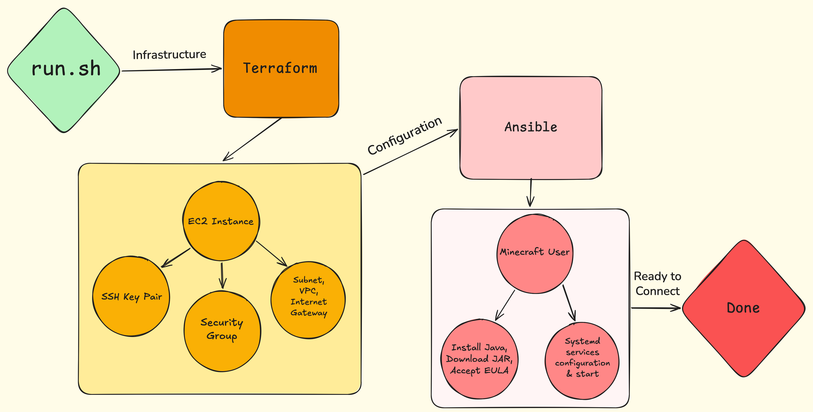

# Automated Minecraft Server

This project repository contains a Shell script ([`run.sh`](./run.sh))
that invokes ***Terraform*** scripts that provision an **AWS EC2** instance 
that is configured using ***Ansible*** for a Minecraft (Java Edition) server.

Simply clone this Git repository,
make the `run.sh` script executable,
and then execute it. 
ヾ(⌐■_■)ノ♪

I.e.,

```bash
git clone git@github.com:alecmoschetti/minecraft-aws-tf-ansible.git && cd minecraft-aws-tf-ansible
chmod +x run.sh && ./run.sh
```

This single command deploys a Minecraft Java Edition Server on AWS that:

- Automatically starts when the EC2 instance starts
- Saves the game when the instance stops

Additionally, with a single command the entire environment can be torn down.
The repository also contains a Shell script ([`teardown.sh`](./teardown.sh))
that will clean and tear down the entire instance.

I.e.,
```bash
chmod +x teardown.sh && ./teardown.sh
```

## Background

The [`run.sh`](./run.sh) script glues a pipeline together with 
**Terraform** and **Ansible**.

### Diagram Pipeline

The pipeline is:



## Requirements

| Tool | Minimum version | Install guide |
|---|---|---|
| [Terraform](https://developer.hashicorp.com/terraform/install) | 1.5 | `brew install terraform` / official installer |
| [Ansible](https://docs.ansible.com/ansible/latest/installation_guide/) | 2.14 | `pip install ansible` |
| [AWS CLI v2](https://docs.aws.amazon.com/cli/latest/userguide/getting-started-install.html) | 2.x | official installer |
| `nmap` | any | `brew install nmap` / `apt install nmap` |

### What Tools Are Dependencies

- **Terraform** >= v1.15.5
  - [Hashicorp Terraform Installation Page](https://developer.hashicorp.com/terraform/install) 
- **Ansible** >= v2.21.0
  - [Ansible Installation Documentation](https://docs.ansible.com/projects/ansible/latest/installation_guide/intro_installation.html)
- **AWS CLI** >= v2.34.60 
  - [AWS CLI Install Page](https://docs.aws.amazon.com/cli/latest/userguide/getting-started-install.html) 
- **`nmap`** 
  - [Homebrew nmap formulae](https://formulae.brew.sh/formula/nmap): `brew install nmap` 

### Environment Variables

Since this repository is designed for spinning up an **AWS** instance for a server,
naturally you need **AWS** credentials. 

1. If you only have an **AWS Academy Learner Lab** credentials, then you need the
following environment variables exported in your terminal.

```bash
export AWS_ACCESS_KEY_ID="ASIA..."
export AWS_SECRET_ACCESS_KEY="..."
export AWS_SESSION_TOKEN="..."
```

2. If instead you have a standard **AWS account** credentials (an **IAM** user key),
then your environment variables to export are slightly different.
No session token is needed.

```bash
export AWS_ACCESS_KEY_ID="AKIA..."
export AWS_SECRET_ACCESS_KEY="..."
```

Either way, 
***make sure to never commit these keys into your Git repository!***

## Commands to Run

Altogether, this is the complete series of commands to run
the pipeline using the `run.sh` shell script.

### 1. Clone the repo

```bash
git clone git@github.com:alecmoschetti/minecraft-aws-tf-ansible.git
cd minecraft-aws-tf-ansible
```

### 2. Export AWS credentials (from Learner Lab)

```bash
export AWS_ACCESS_KEY_ID="ASIA..."
export AWS_SECRET_ACCESS_KEY="..."
export AWS_SESSION_TOKEN="..."
```

### 3. Run the full pipeline

```bash
chmod +x run.sh teardown.sh
./run.sh
```

`run.sh` will print progress for each stage. A successful run ends with:

```
[OK] ════════════════════════════════════════════════════
[OK]  Minecraft server is up!
[OK]
[OK]  Connect in-game :  <public_ip>:25565
[OK]  Verify with nmap:  nmap -sV -Pn -p T:25565 <public_ip>
[OK] ════════════════════════════════════════════════════
```

### 4. Tear down when done

```bash
./teardown.sh
```

This runs `terraform destroy` and removes the generated `.pem` key and inventory file.

## How to Connect After Setup

### Verify the server is reachable

```bash
nmap -sV -Pn -p T:25565 <public_ip>
```

Expected output after running the above command.

```
PORT      STATE SERVICE   VERSION
25565/tcp open  minecraft Minecraft 1.21.4 (Protocol: 127, ...)
```

### Connect with the Minecraft client

1. Open **Minecraft Java Edition**.
2. Click **Multiplayer → Add Server**.
3. Enter the server address: `<public_ip>:25565`
4. Click **Done**, then **Join Server**.

## Sources Used

- [Terraform AWS Guide](https://developer.hashicorp.com/terraform/tutorials/aws-get-started/aws-create) 
- [How to Handle SSH Keys Securely in Terraform](https://oneuptime.com/blog/post/2026-02-23-how-to-handle-ssh-keys-securely-in-terraform/view)
- [Automating EC2 Deployment with Terraform, Ansible, and Shell Script](https://dev.to/shankarthejaswi/automating-ec2-deployment-with-terraform-ansible-and-shell-script-3a75)
- [Terraform Meets Ansible](https://awstip.com/terraform-meets-ansible-bea746acb2b2)
